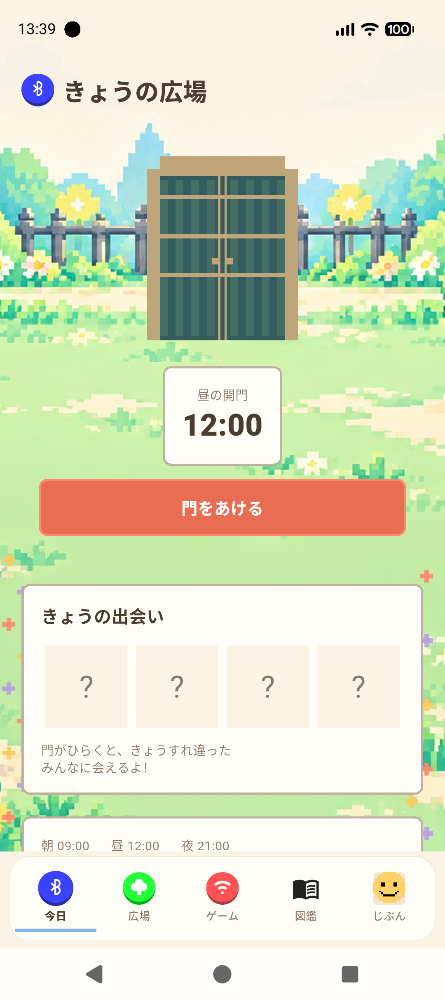
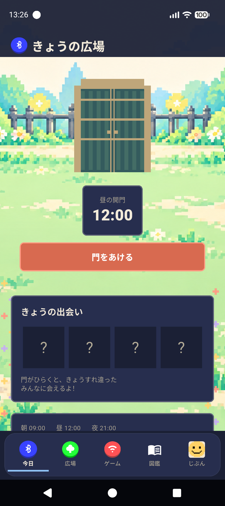
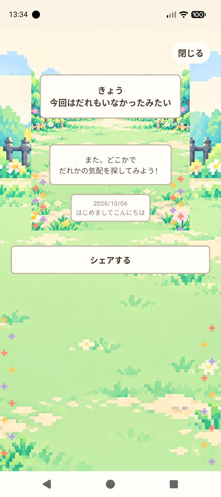

# 「きょうの広場」UI実装 — beta1.13.2+55

基準はユーザーが2026-10-06に渡した [REQUIREMENTS.md](REQUIREMENTS.md) と [concept.png](concept.png)。参照画像を切り抜いてアプリ素材にしていない。

## 構造分析と接続

| 既存 | 新UIからの利用 |
|---|---|
| AppNotifier.gateTimeFor / gatesToShow | 開門時刻・翌朝9時の扱いをそのまま参照 |
| AppNotifier.revealToday | 演出終了／スキップで一度だけ呼び、成功後に結果表示 |
| appProvider.encounters | Today、広場、図鑑、結果の表示元 |
| EncounterDetailSheet | 住民タップ・一覧から既存プロフィール全項目へ |
| PeerIcon / UserIcon | 保存済みドット絵を表示。同期・復元・キャッシュは変更なし |
| puzzleProvider / PuzzleBoardScreen | カケラの保存・解析・進捗・編集・ゲームへの操作を維持 |
| ProfileScreen / SettingsScreen / BadgeScreen | 新しい入口から既存画面と操作を呼ぶ |
| HomeScreen lifecycle / NotificationService | 復帰時回収・通知からTodayへの移動を維持 |

最新の明示仕様によって旧7タブ維持ルールを変更した。機能は削除していない。

| タブ | 内容／移動先 |
|---|---|
| 今日 | 気配・お知らせ・開門・結果・人物詳細・30日履歴 |
| 広場 | 住民集合・会話・プロフィール・全員の名簿・バッジ／カケラ |
| ゲーム | カケラ一覧への入口と枚数、ゲームセンター（既存の公開フラグを維持） |
| 図鑑 | 公開済みの相手のグリッド、すべて／初対面／再会フィルタ、バッジ |
| じぶん | 自作アイコン・名前・ひとこと・自己紹介・登録日・既存統計・編集・設定 |

## 表示／演出

- 未開門の人数・相手を表示しない。疑問符は常に4枠で実人数とは連動しない。
- 通常の「スキャン中」を省略し、停止時だけ「停止中」。気配の10〜30分遅延は維持。
- 次の開門と秒カウントダウン、開門可能時「門をあける」。全体の時計同期は30秒、秒更新は局所化。
- 門の扉を開くCanvas演出→光→人物登場→結果。最大8人を順番に紹介し、残りは集合結果へ。最長約13秒、スキップ可能。
- 初対面／再会の文言を区別。再遭遇の生の回数は従来の抽象ラベルを維持する。
- 広場は既存レベルに連動して花・灯り・飾りを増やす。レベル計算と成長進捗は従来の値を使う。
- 0人は静かな広場、1人は120pxのアイコン、複数は折り返す集合。結果には初対面・再会の人数を表示。
- 1〜4人は小さな光、5〜9人は左右からの粒、10〜19人は紙吹雪、20人以上は放射状の花火。Canvas仮素材。
- 今日にタブを戻しても祝福を再実行しない。アプリ起動／復帰時に未演出の公開結果を対象とし、結果再閲覧は演出も保存も呼ばない。
- 演出既読はUIインスタンス内の状態。プロセス再起動まで跨ぐ永続既読は未実装（既存データ保存方式を変更しない範囲）。
- 共有画像は日付・人数・ドット絵・アプリ名だけ。名前、UID、正確な出会い時刻、自己紹介、場所を含めない。最大20作品を載せ、残りは人数で示す。全員の実データは一覧で閲覧できる。
- 背景は6〜18時を昼、それ以外を夜。UI配色は従来のライト／ダーク／システム設定を保つ。
- パララックスは空・既存の風景・前景の花を別レイヤーで描画。移動比率は0.08／0.24／0.55。画面別強度はToday1、広場0.65、図鑑0.3、ゲーム0.2、じぶん0.08。UI文字・操作を動かさない。
- 図鑑の架空の総人数や未遭遇の実在人物は作らない。登録済み公開相手のみを数える。

## 正式アセットのTODO

現段階は既存の生成済み昼／夜背景と正式タブ原画を利用。次を差し替えると参考画像の質感にさらに近づく。

- [ ] 個別の空／遠景／木々／門と柵／草花の正式PNG（現状の風景は一枚の中景）
- [ ] 門の閉／開の正式スプライト（現在はCanvasの扉）
- [ ] 祝福のスプライト：光／クラッカー／紙吹雪／花火
- [ ] 図鑑用の正式ドット絵アイコン（ドックは本の線画を仮使用）
- [ ] バッジごとの固有絵柄（現在は既存の王冠とバッジ名・レア度）
- [ ] 許諾済みの未遭遇シルエットを使う固定図鑑コンテンツ（ユーザー一覧に架空の総枠は加えない）

## 検証と制限

詳細は REPORT.md。サーバー・サービス・プロバイダー・モデル・BLEネイティブコードに変更を加えていない。
カケラの夜空や編集フォームは既存の操作を優先して保持し、移動先のヘッダー／装飾を統一した。
実機・iOSでの共有シート、横向き／iPad、BLE相互通信は別途確認が必要。

## 実装画面

Pixel 10のrelease APKから撮影。以下は出会い0件のQA端末の画面で、ユーザーの実際の出会いデータではない。
背景の昼夜とUI配色は別設定のため、昼背景＋ダーク配色も正常な組み合わせ。

